# 大数据可视化

### 陈佩佩 沈溢鼎 吴元昊

#### 按姓名首字母排序（假装严谨）

---

# 可视化形式

1. 综合分析
2. 热力图
3. 路线图

---

# 综合分析

~~

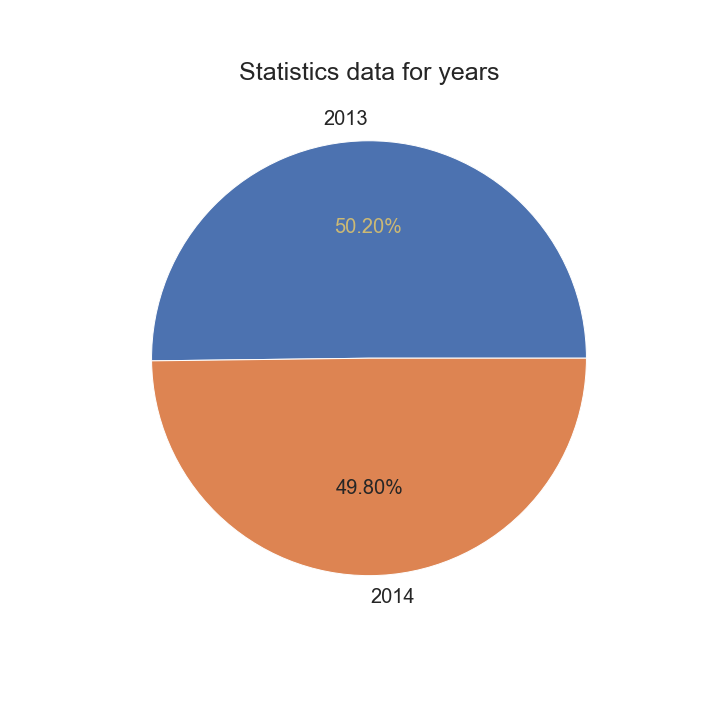

~~

<iframe id="graph1"
	title="graph1"
	src="/html/DVPPT/1year.html" 
	height="520px" 
	width="100%" 
	scrolling="auto" 
	frameborder="0" 
	style="box-shadow: 0px 0px 20px -10px #888;">
</iframe>
~~

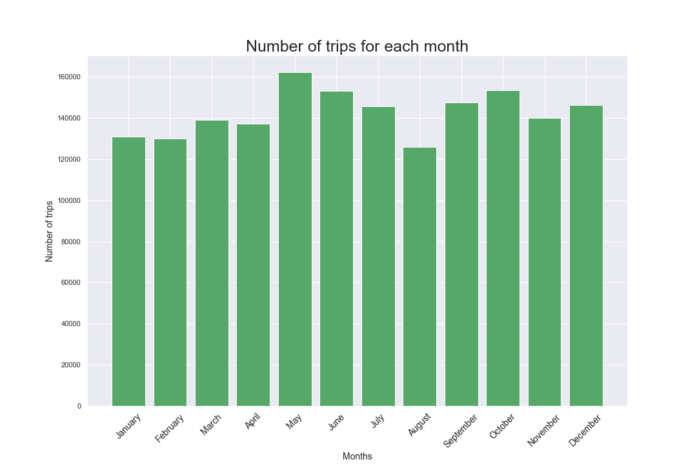

~~

<iframe id="graph2"
	title="graph2"
	src="/html/DVPPT/2month.html" 
	height="520px" 
	width="100%" 
	scrolling="auto" 
	frameborder="0" 
	style="box-shadow: 0px 0px 20px -10px #888;">
</iframe>
~~

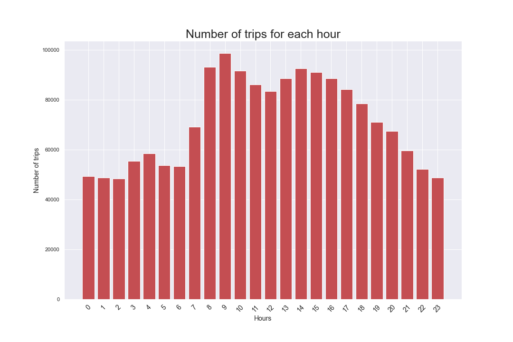

~~

<iframe id="graph3"
	title="graph3"
	src="/html/DVPPT/3hour1.html" 
	height="520px" 
	width="100%" 
	scrolling="auto" 
	frameborder="0" 
	style="box-shadow: 0px 0px 20px -10px #888;">
</iframe>
~~

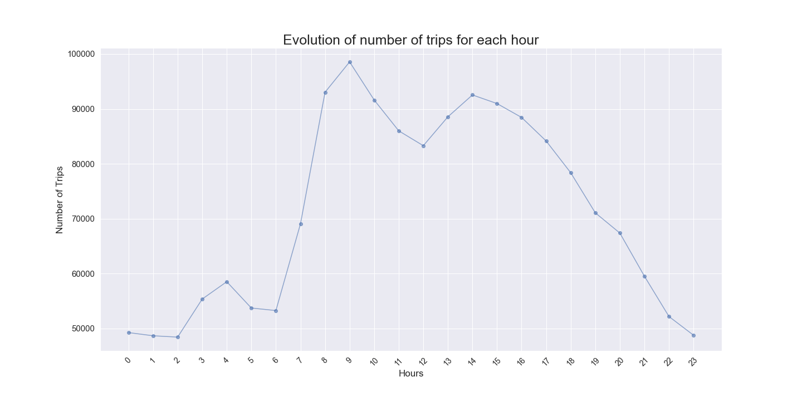

~~

<iframe id="graph4"
	title="graph4"
	src="/html/DVPPT/4hour2.html" 
	height="520px" 
	width="100%" 
	scrolling="auto" 
	frameborder="0" 
	style="box-shadow: 0px 0px 20px -10px #888;">
</iframe>
~~

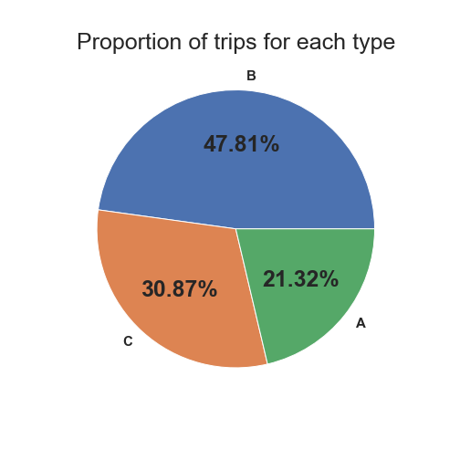

~~

<iframe id="graph5"
	title="graph5"
	src="/html/DVPPT/5type.html" 
	height="520px" 
	width="100%" 
	scrolling="auto" 
	frameborder="0" 
	style="box-shadow: 0px 0px 20px -10px #888;">
</iframe>
~~

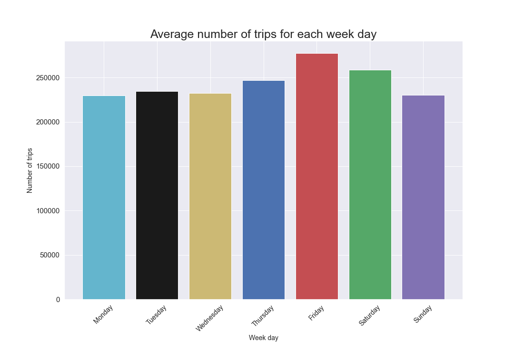

~~

<iframe id="graph6"
	title="graph6"
	src="/html/DVPPT/6average_week_day.html" 
	height="520px" 
	width="100%" 
	scrolling="auto" 
	frameborder="0" 
	style="box-shadow: 0px 0px 20px -10px #888;">
</iframe>
~~

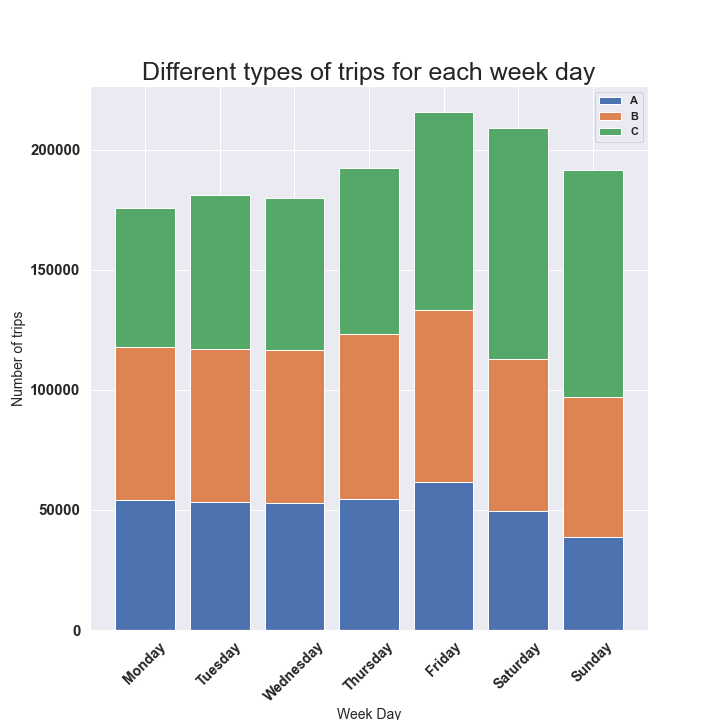

~~

<iframe id="graph7"
	title="graph7"
	src="/html/DVPPT/7type_week_day1.html" 
	height="520px" 
	width="100%" 
	scrolling="auto" 
	frameborder="0" 
	style="box-shadow: 0px 0px 20px -10px #888;">
</iframe>
~~

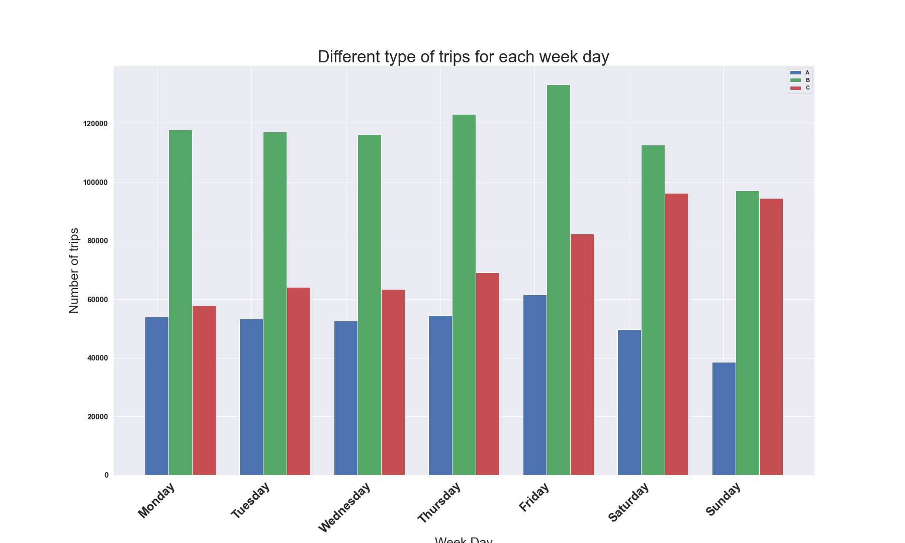

~~

<iframe id="graph8"
	title="graph8"
	src="/html/DVPPT/8type_week_day2.html" 
	height="520px" 
	width="100%" 
	scrolling="auto" 
	frameborder="0" 
	style="box-shadow: 0px 0px 20px -10px #888;">
</iframe>
---

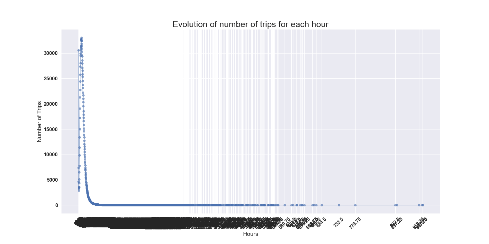

~~

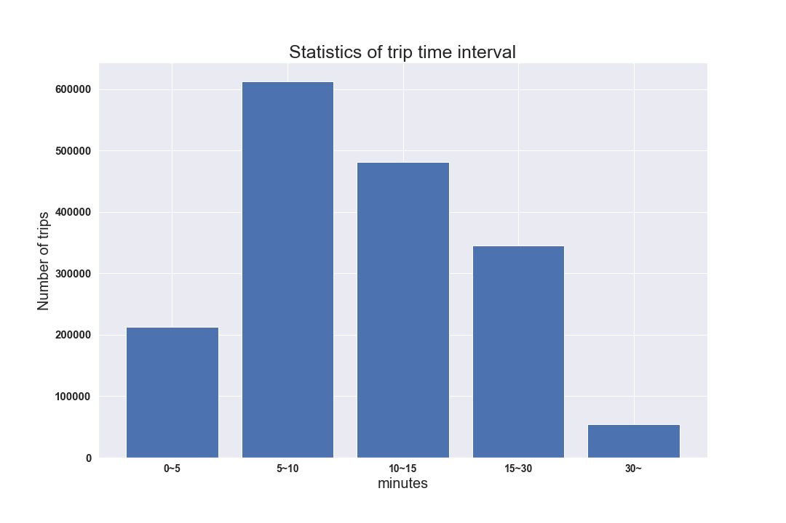

~~

<iframe id="graph9"
	title="graph9"
	src="/html/DVPPT/10trip_interval1.html" 
	height="520px" 
	width="100%" 
	scrolling="auto" 
	frameborder="0" 
	style="box-shadow: 0px 0px 20px -10px #888;">
</iframe>
~~

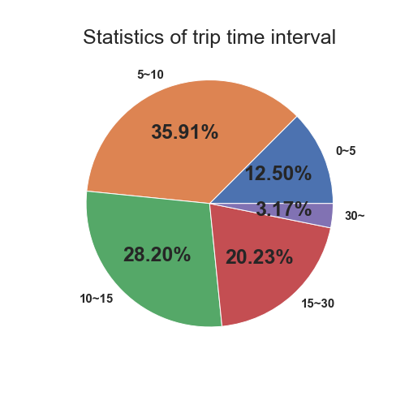

~~

<iframe id="graph10"
	title="graph10"
	src="/html/DVPPT/11trip_interval2.html" 
	height="520px" 
	width="100%" 
	scrolling="auto" 
	frameborder="0" 
	style="box-shadow: 0px 0px 20px -10px #888;">
</iframe>
~~

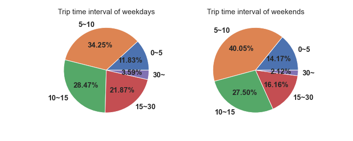

~~

<iframe id="graph11"
	title="graph11"
	src="/html/DVPPT/12trip_comp.html" 
	height="520px" 
	width="100%" 
	scrolling="auto" 
	frameborder="0" 
	style="box-shadow: 0px 0px 20px -10px #888;">
</iframe>
---

# [路线图](https://yuumi0221.github.io/slides/DVPPT1.html)

[回到综合分析](https://yuumi0221.github.io/slides/DVPPT.html#/2)
