# 大数据可视化

### Yuumi 吴元昊 沈溢鼎

#### 按姓名首字母排序（假装严谨）

---

## 数据介绍

- **内容**：

  ​		葡萄牙波尔图出租车运营数据

  ​		https://www.kaggle.com/crailtap/taxi-trajectory

- **数据时间跨度**：

  ​		2016.7.1 —— 2017.6.30

- **数据大小**：

  ​		2.03GB

~~

## 数据信息介绍

每个数据样本对应一个已完成的行程。

它总共包含9个属性，描述如下：

```
TRIP_ID：（字符串）每一次行程都有唯一的TRIP_ID标号，以用来区分。
CALL_TYPE：（字符）由A、B、C三类标识来区分打车形式。A: 由中心调度；B: 在特定站点直接打车；C: 其他类型。
ORIGIN_CALL：（整型）用来唯一标识此次行程消费者的电话号码。
ORIGIN_STAND：（整型）唯一标识出租车站点。
TAXI_ID：（整型）每一次行程中出租车司机的唯一标识。
TIMESTAMP：（整型）Unix 时间戳，标识行程的开始。
DAYTYPE：（字符）由A、B、C三类标识区别出租车行程的日期类型。A: 其他；B: 假期；C: 假期前一天。
MISSING_DATA：（布尔值）当POLYLINE中有一个或多个坐标丢失时，值为true，否则为false。
POLYLINE：（字符串）由坐标序列组成，起始坐标为出发点，结尾坐标为目的地。行程中每隔15秒记录一次坐标信息。
```

~~

## 可视化形式

1. 综合分析

2. 路线图

3. 热力图

---

# 综合分析

~~

## 数据概览

1. 数据年份统计

2. 每月行程数统计

3. 每小时行程数统计

4. 行程类型占比统计

~~

### 数据年份统计

~~

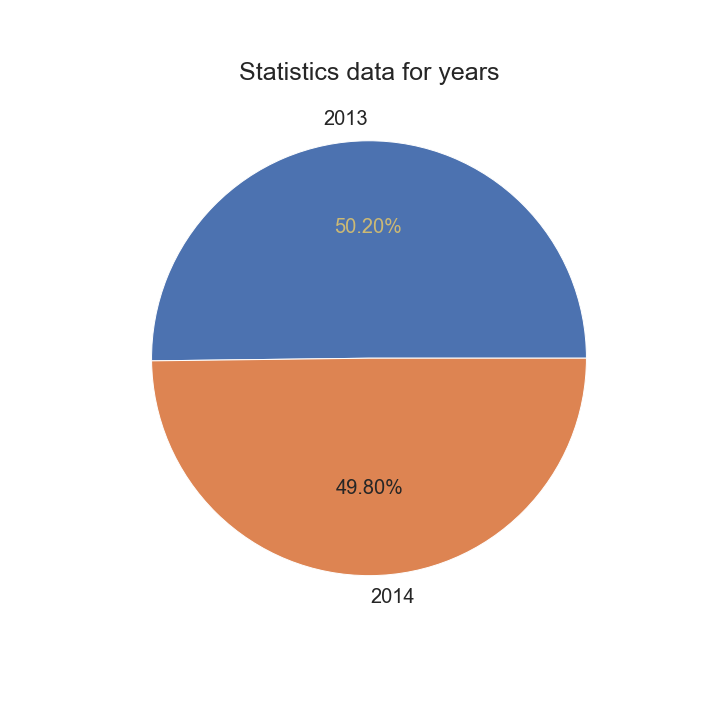

~~

<iframe id="graph1"
	title="graph1"
	src="/html/DVPPT/Analysis/1year.html" 
	height="520px" 
	width="100%" 
	scrolling="auto" 
	frameborder="0" 
	style="box-shadow: 0px 0px 20px -10px #888;">
</iframe>
~~

### 每月行程数统计

~~

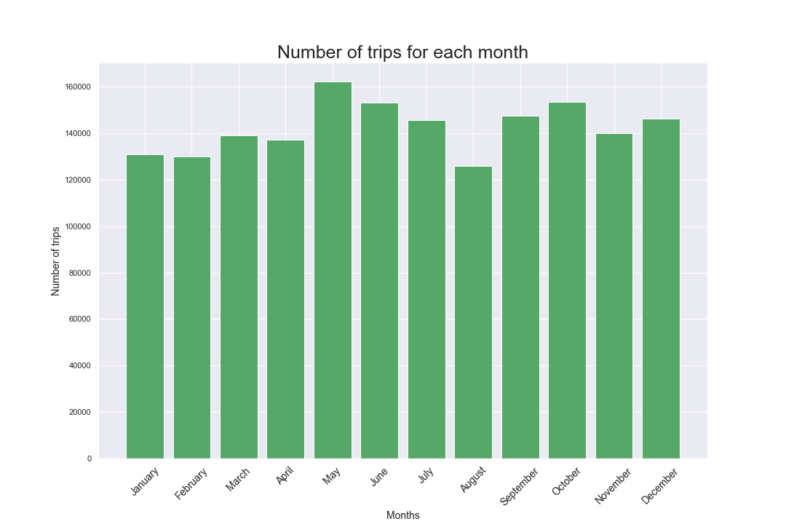

~~

<iframe id="graph2"
	title="graph2"
	src="/html/DVPPT/Analysis/2month.html" 
	height="520px" 
	width="100%" 
	scrolling="auto" 
	frameborder="0" 
	style="box-shadow: 0px 0px 20px -10px #888;">
</iframe>
~~

### 每小时行程数统计

~~

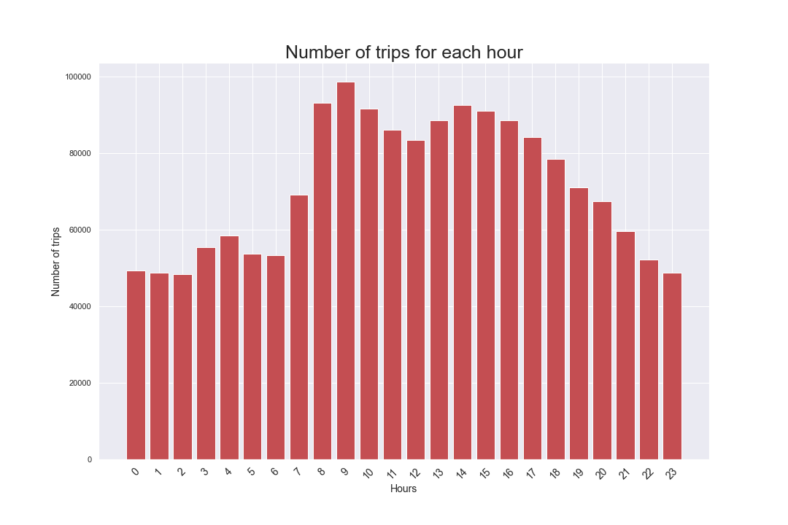

~~

<iframe id="graph3"
	title="graph3"
	src="/html/DVPPT/Analysis/3hour1.html" 
	height="520px" 
	width="100%" 
	scrolling="auto" 
	frameborder="0" 
	style="box-shadow: 0px 0px 20px -10px #888;">
</iframe>
~~

#### 用折线图直观展示

~~

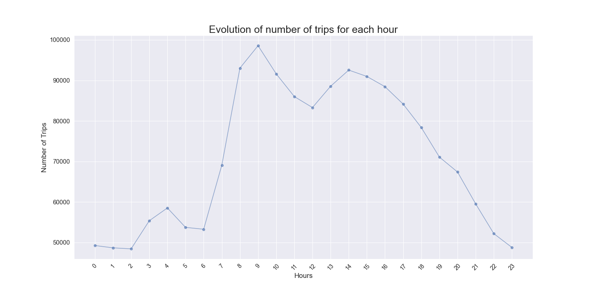

~~

<iframe id="graph4"
	title="graph4"
	src="/html/DVPPT/Analysis/4hour2.html" 
	height="520px" 
	width="100%" 
	scrolling="auto" 
	frameborder="0" 
	style="box-shadow: 0px 0px 20px -10px #888;">
</iframe>
~~

### 行程类型占比统计

~~

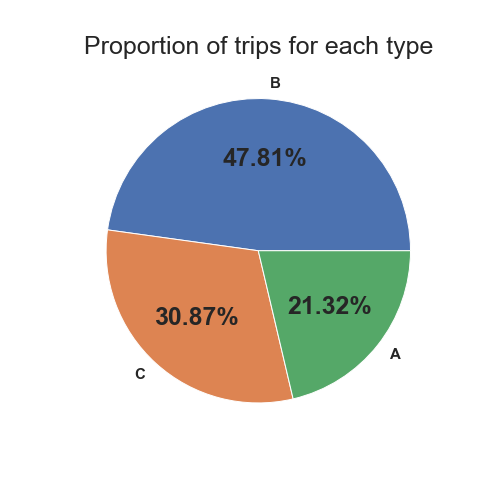

~~

<iframe id="graph5"
	title="graph5"
	src="/html/DVPPT/Analysis/5type.html" 
	height="520px" 
	width="100%" 
	scrolling="auto" 
	frameborder="0" 
	style="box-shadow: 0px 0px 20px -10px #888;">
</iframe>
---

## 行程数-时间 数据分析

1. 一周内平均每日行程数比较

2. 不同类型行程数比较

~~

### 一周内平均每日行程数比较

~~

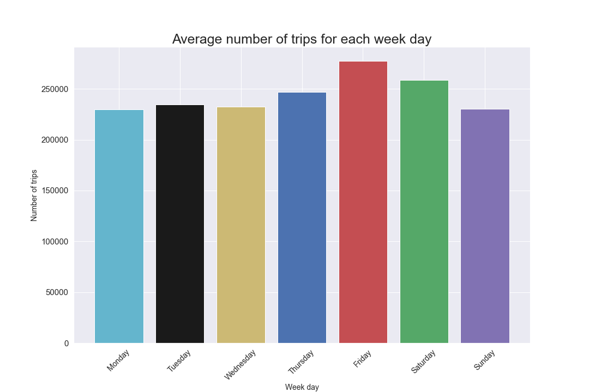

~~

<iframe id="graph6"
	title="graph6"
	src="/html/DVPPT/Analysis/6average_week_day.html" 
	height="520px" 
	width="100%" 
	scrolling="auto" 
	frameborder="0" 
	style="box-shadow: 0px 0px 20px -10px #888;">
</iframe>
~~

### 不同类型行程数比较

~~

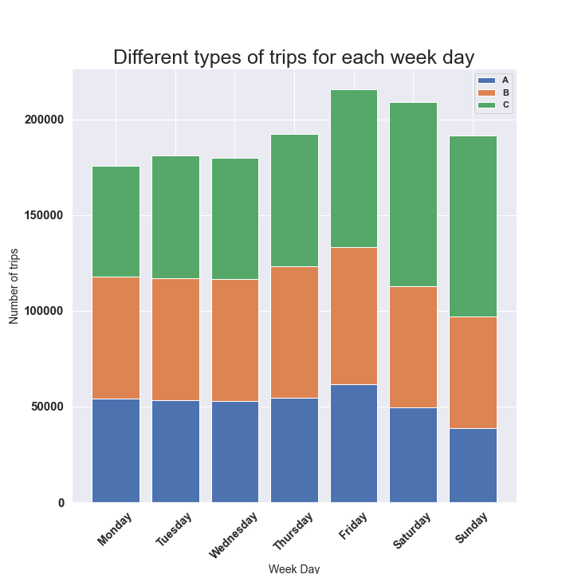

~~

<iframe id="graph7"
	title="graph7"
	src="/html/DVPPT/Analysis/7type_week_day1.html" 
	height="520px" 
	width="100%" 
	scrolling="auto" 
	frameborder="0" 
	style="box-shadow: 0px 0px 20px -10px #888;">
</iframe>
~~

#### 用三元组柱状图展示

~~

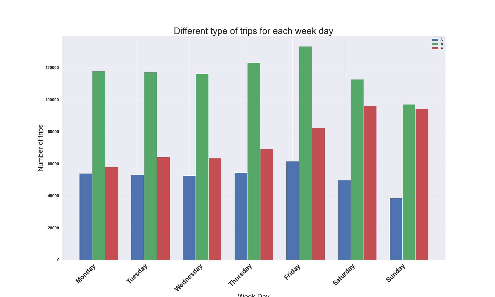

~~

<iframe id="graph8"
	title="graph8"
	src="/html/DVPPT/Analysis/8type_week_day2.html" 
	height="520px" 
	width="100%" 
	scrolling="auto" 
	frameborder="0" 
	style="box-shadow: 0px 0px 20px -10px #888;">
</iframe>
---

## 行驶路线-行程时长 数据分析

1. 行程时长统计

2. 行程时长区间统计

3. 行程时长区间占比

4. 工作日与休息日比较

~~

### 行程时长统计

~~

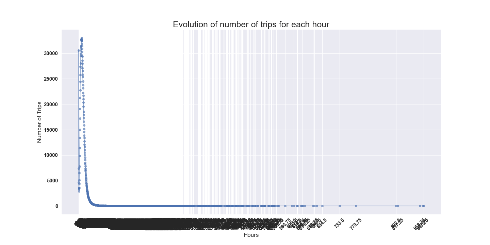

~~

### 行程时长区间统计

~~

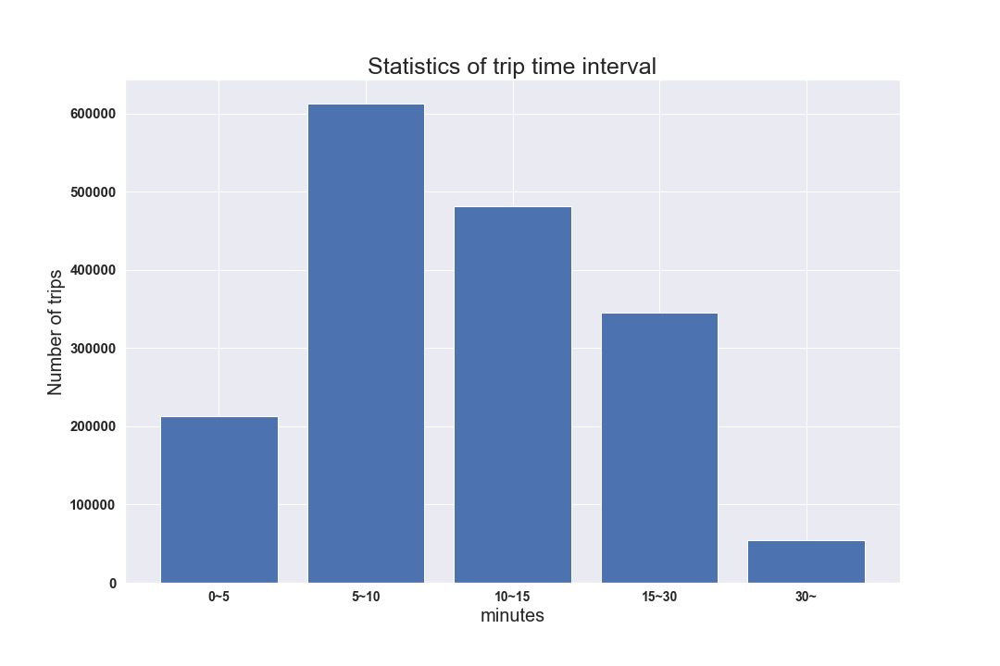

~~

<iframe id="graph9"
	title="graph9"
	src="/html/DVPPT/Analysis/10trip_interval1.html" 
	height="520px" 
	width="100%" 
	scrolling="auto" 
	frameborder="0" 
	style="box-shadow: 0px 0px 20px -10px #888;">
</iframe>
~~

### 行程时长区间占比

~~

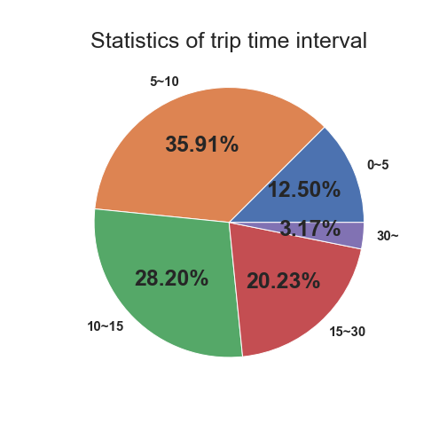

~~

<iframe id="graph10"
	title="graph10"
	src="/html/DVPPT/Analysis/11trip_interval2.html" 
	height="520px" 
	width="100%" 
	scrolling="auto" 
	frameborder="0" 
	style="box-shadow: 0px 0px 20px -10px #888;">
</iframe>
~~

### 工作日与休息日比较

~~

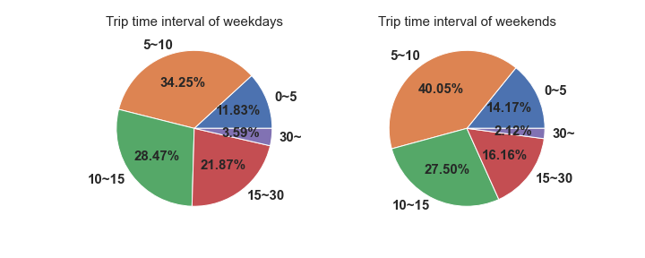

~~

<iframe id="graph11"
	title="graph11"
	src="/html/DVPPT/Analysis/12trip_comp.html" 
	height="520px" 
	width="100%" 
	scrolling="auto" 
	frameborder="0" 
	style="box-shadow: 0px 0px 20px -10px #888;">
</iframe>
---

# [路线图](https://yuumi0221.github.io/slides/DVPPT1.html)

[回到综合分析](https://yuumi0221.github.io/slides/DVPPT.html#/2)
