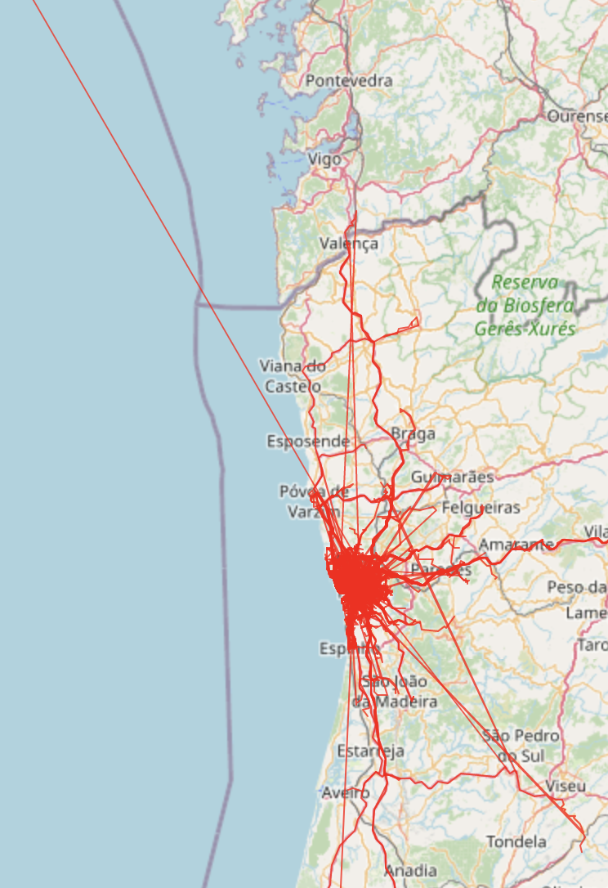
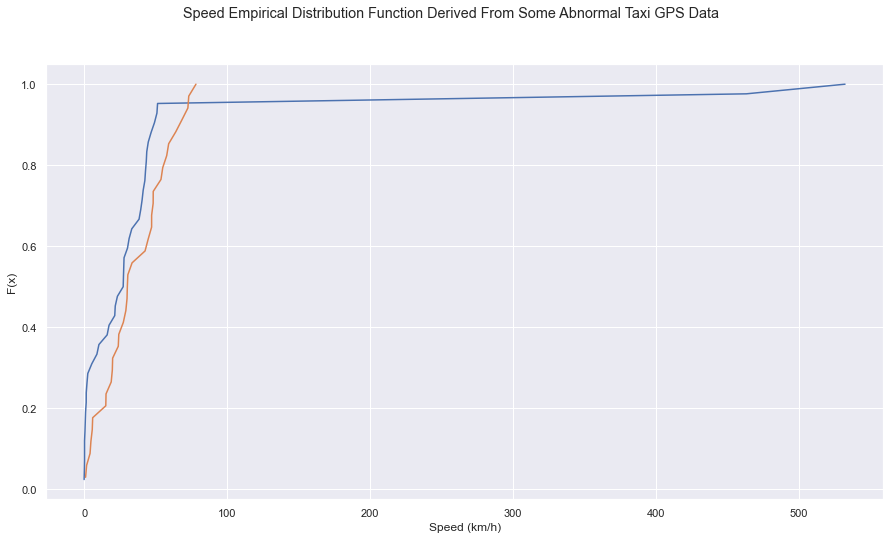
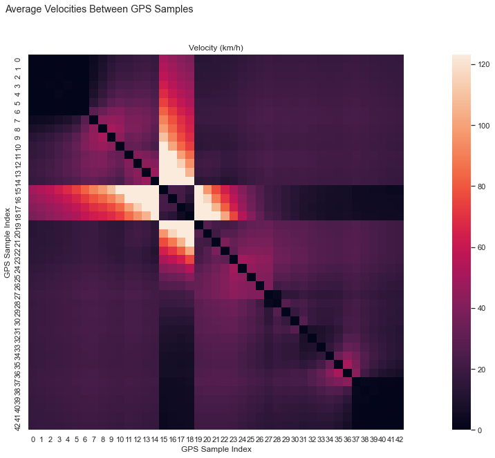
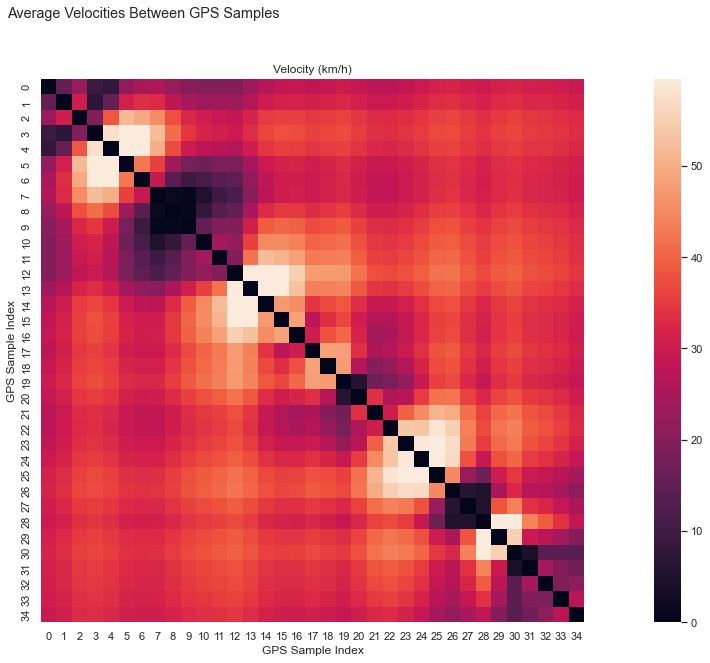
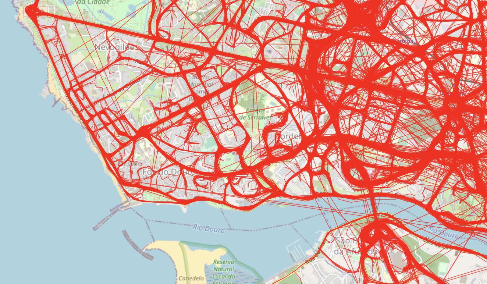

# 路线图

[回到综合分析](https://yuumi0221.github.io/slides/DVPPT.html#/2)

---

#### 原本是实现出租车地理数据在卫星地图上的显示

#### 调用了python的pandas库和folium库

##### 具体的代码如下：

~~

```python
import numpy as np
import pandas as pd
import geopandas as gpd
import json
from shapely.geometry import LineString, Point
from folium import plugins
import folium
import os
import ast

def load_data(fname, nrows):
    df = pd.read_csv(fname, nrows=nrows)
    df['traj'] = json.loads('[' + df.POLYLINE.str.cat(sep=',') + ']')
    df = df[df.traj.str.len() > 1].copy()
    df['lines'] = gpd.GeoSeries(df.traj.apply(LineString))
    return gpd.GeoDataFrame(df, geometry='lines')

df = load_data('../../sources/taxi/train.csv', nrows=10000)

m = folium.Map([41.2, -8.6], zoom_start=25) #中心区域的确定
for i in range (0, 19000):
    tmp = df.iloc[[i],[8]].values
    tmp = tmp[0][0]
    li = ast.literal_eval(tmp)
    for j in range(len(li)):
        li[j][0], li[j][1] = li[j][1], li[j][0]
    route = folium.PolyLine( #polyline方法为将坐标用线段形式连接起来
        li, #将坐标点连接起来
        weight=1, #线的大小为3
        color='red', #线的颜色为橙色
        opacity=0.8 #线的透明度
    ).add_to(m) #将这条线添加到刚才的区域m内

m.save('../../html/Road/BeforeCleaning.html') #将结果以HTML形式保存到桌面上
```

~~

##### 实现后却意外的发现：

~~

##### 存在许多不在道路上的线


~~

##### 甚至有到海里去的线


~~

<iframe id="graph12"
	title="graph12"
    src="/html/DVPPT/Road/BeforeCleaning.html"
	height="520px" 
	width="100%" 
	scrolling="auto" 
	frameborder="0" 
	style="box-shadow: 0px 0px 20px -10px #888;">
</iframe>

---

#### 所以我们就需要考虑数据的清洗

#### 那么如何进行清洗呢？

~~

### 首先看看几个点的速度经验分布图像



可以看到其中的一条甚至出现了超过300km/h的速度，而另一条相对更佳合理一些

~~

#### 上图可能不够直观，因此我们分别绘制了他们点到点的的速度图

实现的代码如下：

```python
def velocity_graph(ax, coords):
    n = len(coords)
    dist = haversine(coords)
    interval = dt*np.abs(np.arange(n)[:,None] - np.arange(n)).clip(1)
    vel = R*dist/interval
    sns.heatmap(vel, ax=ax, square=True, robust=True)
    ax.set_title('Velocity (km/h)')
    ax.set_xlabel('GPS Sample Index')
    ax.set_ylabel('GPS Sample Index')

fig, axes = plt.subplots(1, 1, figsize=[25,10])
fig.suptitle("Average Velocities Between GPS Samples")
velocity_graph(axes, df.traj[3])

fig, axes = plt.subplots(1, 1, figsize=[25,10])
fig.suptitle("Average Velocities Between GPS Samples")
velocity_graph(axes, df.traj[43])
```

~~



~~



---

#### 尝试用计算机手段清洗数据

###### 经过上面的操作我们可以看出数据清洗的必要性

###### 但是通过一个一个速度分布图像的观察来查找应当清洗的数据显然不可行

###### 因此我们希望可以通过编程的办法来实现

~~

##### 通过查找资料，我发现利用随机游走算法可以大致看出一些规律

.png)

~~

我们不难看到，在时间为10min左右的时候，其距离的分布似乎趋近于高斯分布，距离集中于此处。所以我们放大前10分钟的数据，并将其拟合为有理函数。

~~


~~

###### 如何利用上述规则去发现无效的点呢？

###### 我们用贝叶斯概率去构造它，其中Xi是路线中的某一点，Ri是其余的点


~~

该结果估计了已给定单个位置的出租车

***其路线其余部分出现的概率***

***除以***

***它完全不移动的路线的概率***

简单来说，就是这个点更像是在路线中出现还是更像路线以外的点

---

### 数据清洗后


~~

<iframe id="graph12"
	title="graph12"
    src="/html/DVPPT/Road/AfterCleaning.html"
	height="520px" 
	width="100%" 
	scrolling="auto" 
	frameborder="0" 
	style="box-shadow: 0px 0px 20px -10px #888;">
</iframe>
---

### 缺点

1. 分析数据不够完全；

2. 数据处理的算法有待改进；

3. 显示路径不够直观。

---

# [热力图](https://yuumi0221.github.io/slides/DVPPT2.html)

[回到路线图](https://yuumi0221.github.io/slides/DVPPT1.html#/)
