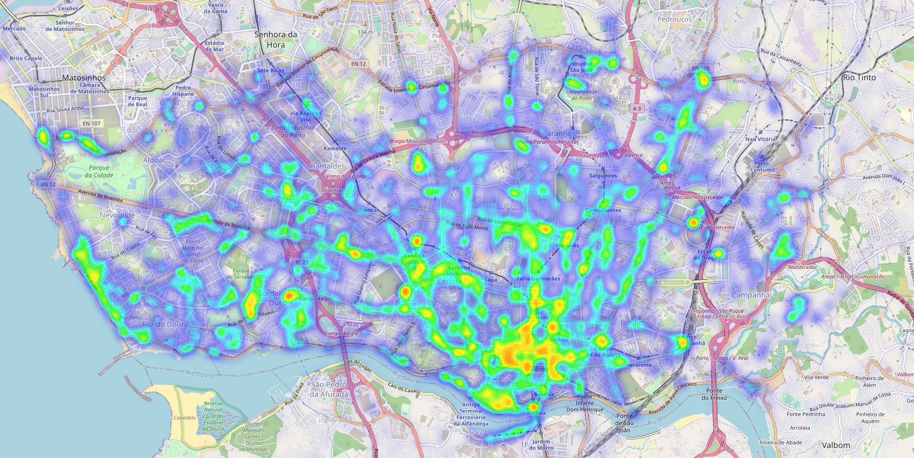
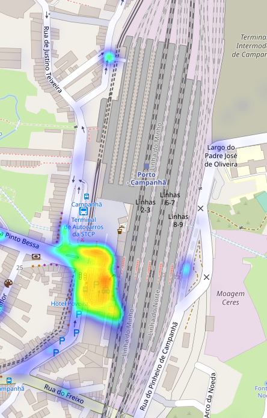
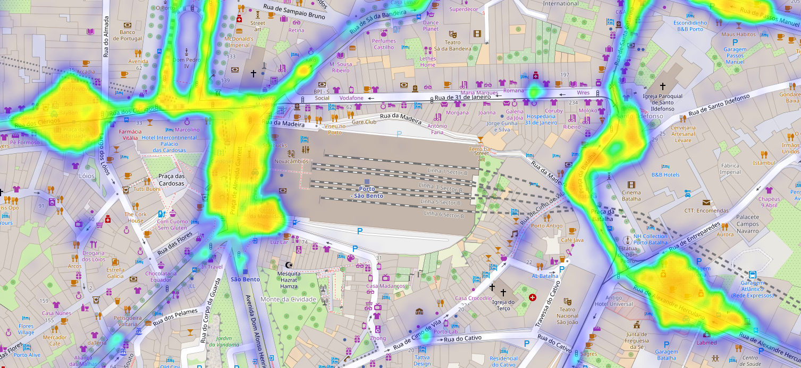
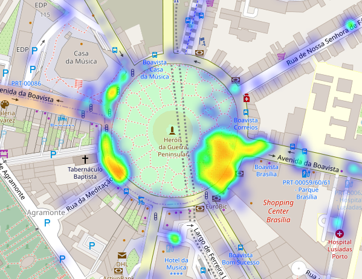
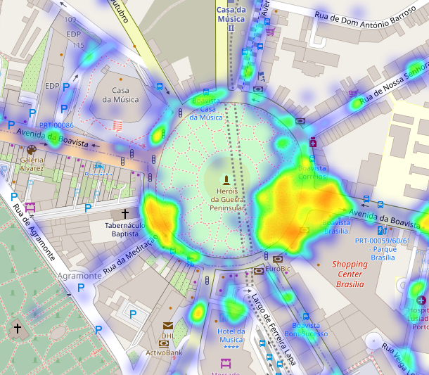
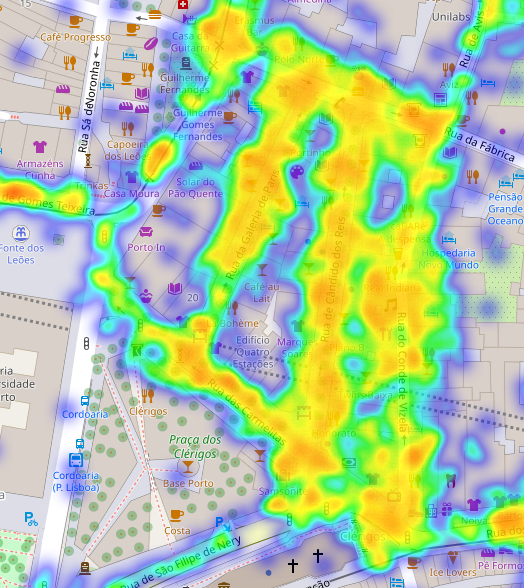
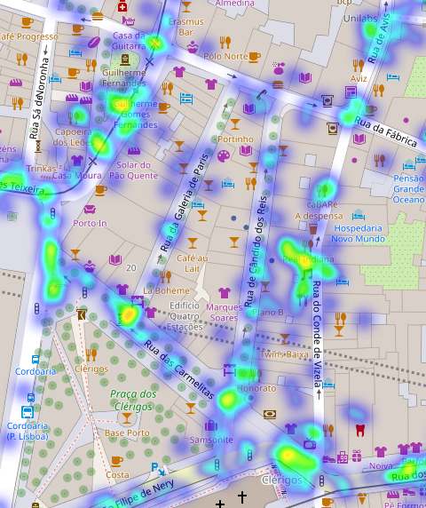

# 热力图

[回到路线图](https://yuumi0221.github.io/slides/DVPPT1.html#/)

~~

## 总体热力图

~~

<iframe id="graph12"
	title="graph12"
    src="/html/DVPPT/heatMap/index.html"
	height="650px" 
	width="100%" 
	scrolling="auto" 
	frameborder="0" 
	style="box-shadow: 0px 0px 20px -10px #888;">
</iframe>

~~

### 火车站

~~

---

## 以小时颗粒度分片绘制热力图

~~

<iframe id="graph12"
	title="graph12"
    src="/html/DVPPT/hour_1/index.html"
	height="650px" 
	width="100%" 
	scrolling="auto" 
	frameborder="0" 
	style="box-shadow: 0px 0px 20px -10px #888;">
</iframe>
~~

### 2:00 A.M.

~~

### 18:00 P.M.

~~

### 3:00 A.M.

~~

### 14:00 P.M.

~~

### 3:00 A.M.

~~

### 14:00 P.M.

~~

<iframe id="graph12"
	title="graph12"
    src="/html/DVPPT/hour_2/index.html"
	height="650px" 
	width="100%" 
	scrolling="auto" 
	frameborder="0" 
	style="box-shadow: 0px 0px 20px -10px #888;">
</iframe>
---

# [总结与评估](https://yuumi0221.github.io/slides/DVPPT3.html)

[回到热力图](https://yuumi0221.github.io/slides/DVPPT2.html)
